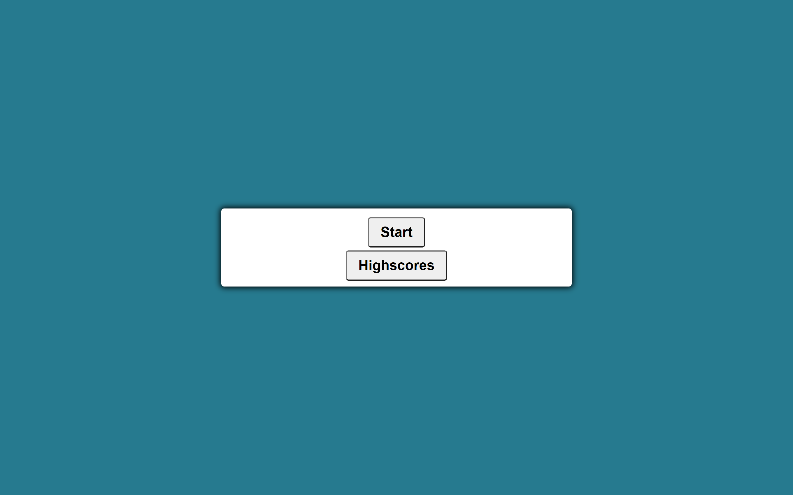

# Coding Quiz

## Description  
This application is a quiz that tets the user on their javascript knowledge with the use of Web APIs. The user will answer a variety of questions regarding javascript with a timer counting down, if they answer a question incorrectly they will lose time. If the user can complete the quiz in the alloted time then the user cna save their score which will be however much time they have left.  

## Resources

## Live Application
[Coding Quiz](https://spurgason.github.io/coding-quiz/)
## Credits
[Shane Purgason](https://github.com/spurgason)

## Questions
[Github](https://github.com/spurgason)  
[Email](mailto:shanepurgason.98@gmail.com)